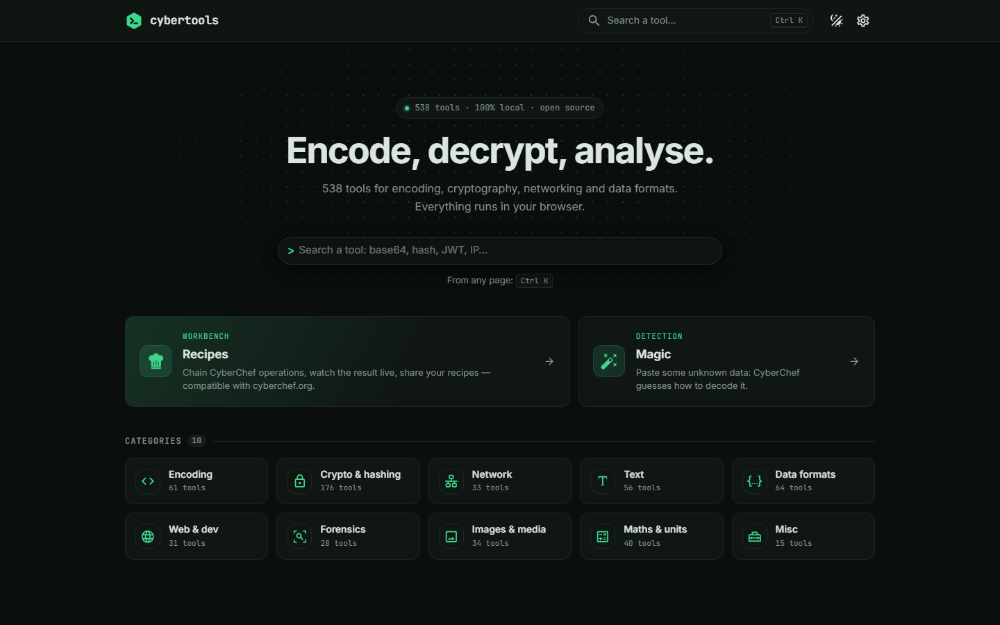
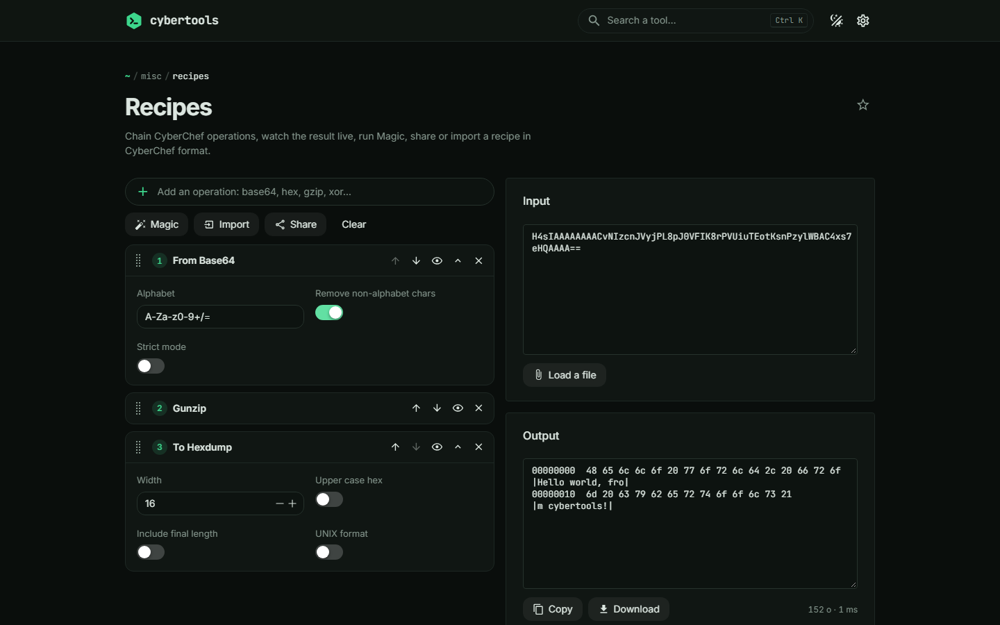
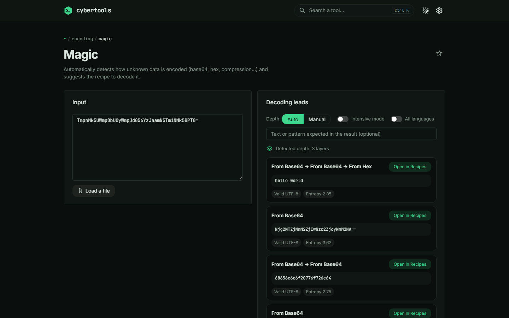
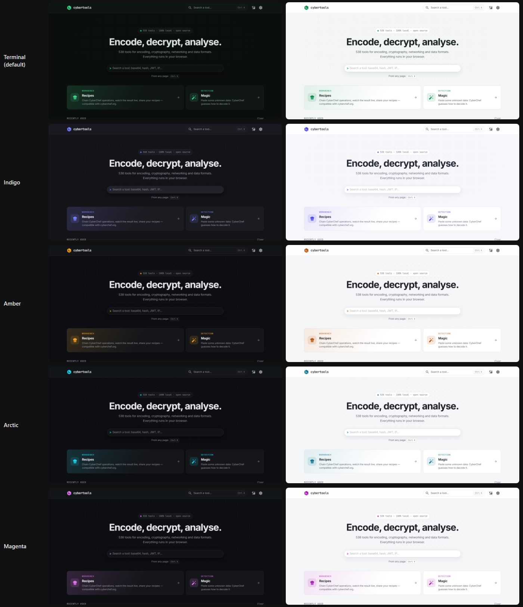
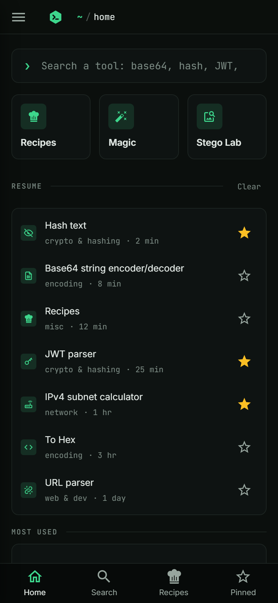

<div align="center">


# cybertools

**[CyberChef](https://github.com/gchq/CyberChef) and [IT-Tools](https://github.com/CorentinTh/it-tools) in a single interface.**
539 tools for encoding, cryptography, networking and analysis — everything runs in your browser.

[](https://github.com/KenzoPortela/cybertools/actions/workflows/ci.yml)
[](https://github.com/KenzoPortela/cybertools/actions/workflows/docker.yml)
[](LICENSE)
[](https://github.com/KenzoPortela/cybertools/issues)

</div>



> **Beta — v0.1.0.** Some tools may not behave perfectly yet, and the interface
> is still far from finished. I am happy enough with the current state of cybertools to release it to the public as a beta, so that you can discover cybertools. I am doing my best to make the interface more polished and fix the broken behaviours. If something is broken,
> confusing or simply annoying, please
> [open an issue](https://github.com/KenzoPortela/cybertools/issues/new/choose) —
> I will be happy to fix it.

## Why

CyberChef is unbeatable for chaining operations; IT-Tools is nicer for everyday
one-shot tasks. Using both means two interfaces, two searches, two habits.
cybertools brings them together **without modifying either**: their sources are
cloned as-is, and every adaptation lives in this repository.

- **539 tools**: the 86 from IT-Tools, 450 CyberChef operations, the recipe
  workbench, Magic and the Stego Lab, filed into ten categories, with no
  duplicates.
- **One search**, in English or French, forgiving of typos ("caeser cipher"
  finds *Caesar Box Cipher* and *ROT13*), with a command palette
  (<kbd>Ctrl</kbd> <kbd>K</kbd>), favourites and recent tools.
- **Recipes**: CyberChef operations chained with a live result. Recipe links are
  exchanged with cyberchef.org both ways.
- **Magic**, with automatic depth detection: it peels layer after layer until
  there is nothing left to decode.
- **Nothing leaves the browser.** No server, no analytics; the Content Security
  Policy served by the image forbids the browser any connection to another
  origin.
- Light or dark theme, **five accent colours**, English and French, usable on a
  phone.

| Recipes | Magic |
|---|---|
|  |  |

<details>
<summary>Colour themes and mobile layout</summary>




</details>

## Hosting cybertools

The image is published for amd64 and arm64 on the GitHub Container Registry, so
the server has nothing to compile.

```bash
docker run -d --name cybertools -p 8080:8080 ghcr.io/kenzoportela/cybertools:latest
# → http://localhost:8080
```

Or with Docker Compose, using the repository's
[`docker-compose.yml`](docker-compose.yml) — read-only container, no extra
privileges, health check on `/healthz`:

```bash
docker compose up -d                        # → http://localhost:8080
CYBERTOOLS_PORT=9000 docker compose up -d   # another port
```

No environment variable is required. The container serves plain HTTP on port
8080 and expects nothing else.

### Behind a reverse proxy

`docker-compose.yml` publishes port 8080 on the host, which is the simplest case
but collides with a proxy already listening there. Use
[`docker-compose.proxy.yml`](docker-compose.proxy.yml) instead: same container,
no published port, the proxy reaches port 8080 over the Docker network.

```bash
docker compose -f docker-compose.proxy.yml up -d
```

On a platform that generates the proxy configuration for you, point it at this
file and give it the domain; `/healthz` answers `ok` for health checks.

HTTPS is only needed for IT-Tools' camera recorder — browsers refuse the camera
outside a secure context. Everything else works over plain HTTP.

### Building the image yourself

```bash
docker compose -f docker-compose.yml -f docker-compose.build.yml up -d --build
```

The build clones CyberChef and IT-Tools at the revisions pinned in
[`vendor.lock.json`](vendor.lock.json), builds the CyberChef engine, then the
application; expect a few minutes and about 4 GB of memory.

### Without Docker

cybertools is a static site: build it and serve `dist/` with any web server.

```bash
npm run vendor:setup && npm run vendor:sync-deps && npm install
npm run build        # → dist/
npm run preview      # or any static server
```

One requirement: serve `index.html` for unknown paths, since it is a single-page
application. Node is only needed to build; nothing runs server-side afterwards.

## Development

```bash
git clone https://github.com/KenzoPortela/cybertools.git
cd cybertools

npm run vendor:setup      # clones CyberChef and IT-Tools into vendor/
npm run vendor:sync-deps  # copies their dependencies into package.json
npm install
npm run dev
```

Node 24 or newer, and git. Everything else — architecture, catalogue, CyberChef
engine, overrides, themes, verification in a real browser — is in
**[docs/DEVELOPMENT.md](docs/DEVELOPMENT.md)**.

## Known limitations

- **The inside of IT-Tools' tools stays in English.** The interface, titles and
  descriptions are translated; the labels inside each tool are hard-coded in
  their components, and translating them would mean modifying their sources.
- **The camera recorder needs HTTPS** (or `localhost`): browsers only open the
  camera in a secure context. Everything else works over plain HTTP, clipboard
  included.
- **Four CyberChef operations are excluded.** Three contact a third party, which
  would break the "nothing leaves your browser" promise: *HTTP request* (sends a
  request with your data), *DNS over HTTPS* (sends the queried name to Google or
  Cloudflare), *Show on map* (loads Leaflet from unpkg.com and OpenStreetMap
  tiles). The fourth, *Automated Validation Test Op*, is an internal test
  operation.
- **Four CyberChef operations lose a graphic.** Their HTML output relies on a
  script that depends on CyberChef's own interface (CodeMirror, jQuery,
  `CanvasComponents`) and cannot run here. The computed result is still shown;
  only the graphic is missing: the *Entropy* gauge in "Shannon scale" mode (its
  four other modes, in SVG, work), the *Frequency distribution* histogram, the
  *Index of Coincidence* gauge, and the interactive colour picker of *Parse
  colour code*.
- **CyberChef operation names and descriptions are in English**, as published by
  CyberChef. The translation mechanism is in place (`app.ops.<slug>`), the texts
  remain to be written.
- **Two upstream warnings** remain in the console, without effect: a mistyped
  prop in `ascii-text-drawer`, and bcryptjs trying Node's `crypto` module before
  falling back, as designed, to WebCrypto (in development only).

## Feedback

This is a beta, and feedback is what makes it better: a tool that computes the
wrong thing, a layout that breaks, a word that reads badly, a missing shortcut —
[open an issue](https://github.com/KenzoPortela/cybertools/issues/new/choose).
Pull requests are welcome too; see [CONTRIBUTING.md](CONTRIBUTING.md).

A bug that belongs to a tool itself is best reported to its own project
([CyberChef](https://github.com/gchq/CyberChef/issues),
[IT-Tools](https://github.com/CorentinTh/it-tools/issues)) — fixes land here at
the next upstream update.

## Credits

The tools come from two projects, used **without modifying their sources**:

- **[CyberChef](https://github.com/gchq/CyberChef)** (GCHQ, Apache-2.0) — the
  operation engine, recipes and the Magic automatic detection;
- **[IT-Tools](https://github.com/CorentinTh/it-tools)** (Corentin Thomasset,
  GPL-3.0) — the developer tools and their component kit.

See [`CREDITS.md`](CREDITS.md).

## License

GPL-3.0-only — see [`LICENSE`](LICENSE). Not a preference, but a consequence of
reusing IT-Tools' code. CyberChef's code remains under Apache-2.0.

Built and adapted by **[Kenzo Portela](https://github.com/KenzoPortela)** —
[kenzoportela.com](https://kenzoportela.com).
